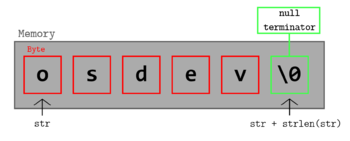

# How "Hello" Is Stored in Memory



When you write:

```cpp id="z9k2fd"
cout << "Hello";
```

The string `"Hello"` is stored in memory as a sequence of characters followed by a **null terminator**.

Actual memory representation:

```id="ml98s2"
H   e   l   l   o   \0
```

---

## ASCII Values

| Character | ASCII Value |
| --------- | ----------- |
| H         | 72          |
| e         | 101         |
| l         | 108         |
| l         | 108         |
| o         | 111         |
| \0        | 0           |

So internally the memory becomes:

```id="3uz9z5"
72 101 108 108 111 0
```

---

# Why the `\0` Null Terminator Exists

In **C and C++**, strings are stored as **character arrays**.

The system must know **where the string ends**.

Instead of storing the length separately, the language uses:

```id="5o9ktv"
\0
```

which means **end of string**.

Example:

```cpp id="v38fzi"
char str[] = "Hello";
```

Memory:

```id="hm9g0m"
H e l l o \0
```

---

# How `cout` Prints the String

When `cout` receives a string literal:

```cpp id="jjj9c0"
cout << "Hello";
```

It receives a **pointer to the first character**.

Conceptually:

```cpp id="u3c5t9"
const char* ptr = "Hello";
```

So `"Hello"` is treated as:

```id="2n1m8j"
pointer → 'H'
```

Then the output function behaves like:

```cpp id="2fw1h7"
while(*ptr != '\0')
{
    print(*ptr);
    ptr++;
}
```

So it prints characters **until it reaches `\0`**.

---

# Where String Literals Are Stored

String literals are stored in the **read-only data section** of the program.

Simplified memory layout:

```id="z0e23b"
Code Section
    instructions

Read-Only Data
    "Hello"

Heap
    dynamic memory

Stack
    local variables
```

So `"Hello"` lives in **read-only memory**.

That is why this is dangerous:

```cpp id="rbxtxj"
char* str = "Hello";
str[0] = 'X';   // ❌ undefined behavior
```

Because you are trying to **modify read-only memory**.

---

# What the Compiler Actually Creates

When you write:

```cpp id="q77r8a"
cout << "Hello";
```

The compiler generates memory like:

```id="j1un4v"
address → H
           e
           l
           l
           o
           \0
```

Example addresses:

```id="3vsh9h"
0x400500 → 'H'
0x400501 → 'e'
0x400502 → 'l'
0x400503 → 'l'
0x400504 → 'o'
0x400505 → '\0'
```

---

# Difference Between `char[]` and String Literal

## String Literal

```cpp id="0y4qpy"
char* str = "Hello";
```

Stored in **read-only memory**.

---

## Character Array

```cpp id="z2xpp5"
char str[] = "Hello";
```

Stored in **stack memory**.

Memory:

```id="2p8fqa"
Stack
H e l l o \0
```

This can be modified:

```cpp id="sx9m7r"
str[0] = 'X';
```

Result:

```id="i3h4mz"
Xello
```

---

# Relationship Between Strings and Pointers

When you write:

```cpp id="3vgy5e"
"Hello"
```

The type is actually:

```id="1oknzb"
const char*
```

Meaning:

```id="k3k72v"
pointer to first character
```

So `"Hello"` is equivalent to:

```id="trq2o0"
&"Hello"[0]
```

---

# Pointer Movement Example

Example:

```cpp id="7sr0z7"
const char* p = "Hello";

cout << *p << endl;
p++;
cout << *p;
```

Output:

```id="imwaj5"
H
e
```

Pointer moves like:

```id="g93t1r"
H → e → l → l → o → \0
```

---

# Why `\0` Is Important

Without the null terminator, the program would not know where the string ends.

Example problem:

```id="vngndd"
H e l l o X Y Z ...
```

The program would continue reading memory until it accidentally finds a **zero byte**, which could cause:

* garbage output
* crashes

---

# Key Insight

A C/C++ string is simply:

```id="axv16i"
array of characters + null terminator
```
